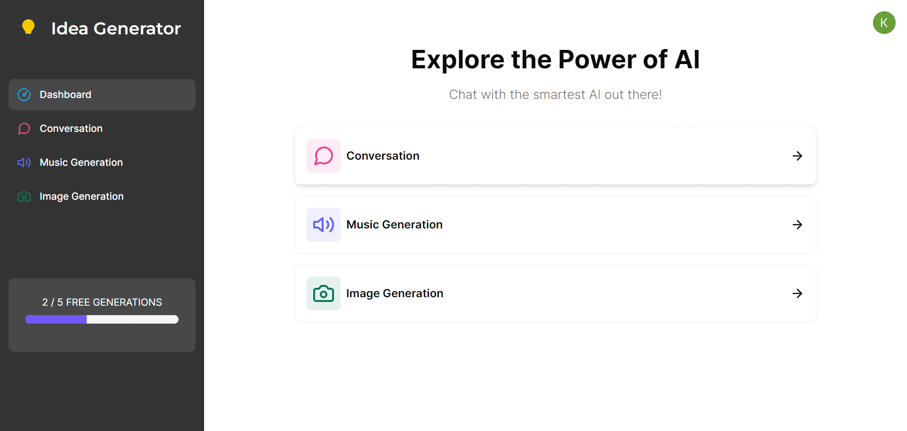
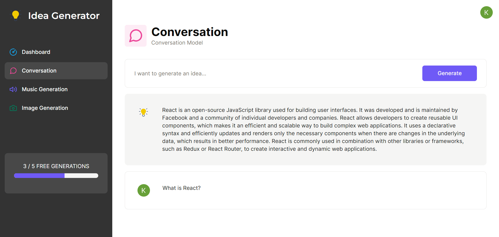
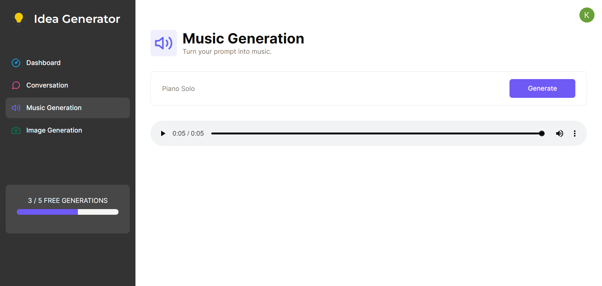
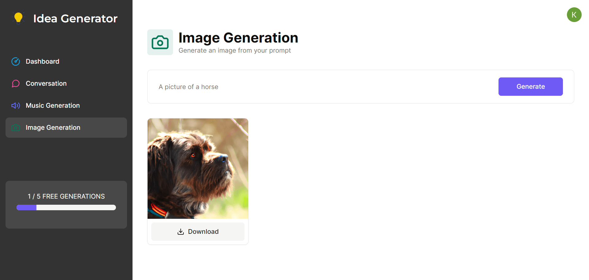

# **Idea Generator**

## **Table of Contents**
- [License](#license)
- [Project Overview](#project-overview)
- [Dashboard](#dashboard)
- [Conversation](#conversation)
- [Unique Technologies](#unique-technologies)
- [Technologies Used](#technologies-used)
- [Deployment](#Deployment)

## **License**
This project is licensed under the MIT license.

## **Project Overview**
Using the intelligence of A.I., this Idea Generator creates unique ideas in the form of text, images, and sound. Each user gets 5 uses before a 24 hour cool down is initiated. 

## **Dashboard**

## **Conversation**

## **Music**

## **Image**

## **Unique Technologies**
**Open AI API**

The OpenAI API is a digital interface provided by OpenAI that allows developers, researchers, and businesses to access and utilize OpenAI's state-of-the-art machine learning models, most notably models like GPT-3 and GPT-4. Through this API, users can integrate the capabilities of these models into their applications, websites, and services, enabling a wide range of functionalities, from natural language processing to content generation, translation, and much more. By providing such an interface, OpenAI has democratized access to advanced AI technologies, making it easier for innovators worldwide to build and deploy AI-driven solutions without the need to train their own models or invest heavily in computational infrastructure.

**Clerk**

Clerk Auth is a user authentication and authorization service that provides developers with a simple and secure way to add authentication to their applications. Clerk Auth supports a variety of authentication methods, including email/password, social login, and two-factor authentication. It also provides a variety of features to help developers manage their users, such as user profiles, user groups, and user roles.

**Shadcn UI**

Shadcn UI is a collection of reusable components built using Radix UI and Tailwind CSS. It is not a component library, but rather a set of components that you can copy and paste into your apps. The components are accessible and customizable, and they are designed to be used together to create beautiful and user-friendly interfaces.

## **Technologies Used**
Front End

* Open AI API
* Next.js
* React.js
* TypeScript
* Tailwind CSS
* HTML5
* Shadcn UI
* Clerk

Back End
* Prisma
* MySQL

## **Deployment**
[Deployment Link](https://kedgards-idea-generator.vercel.app/)